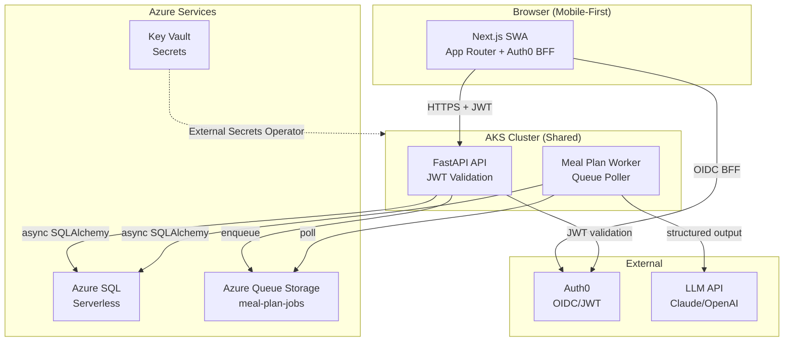
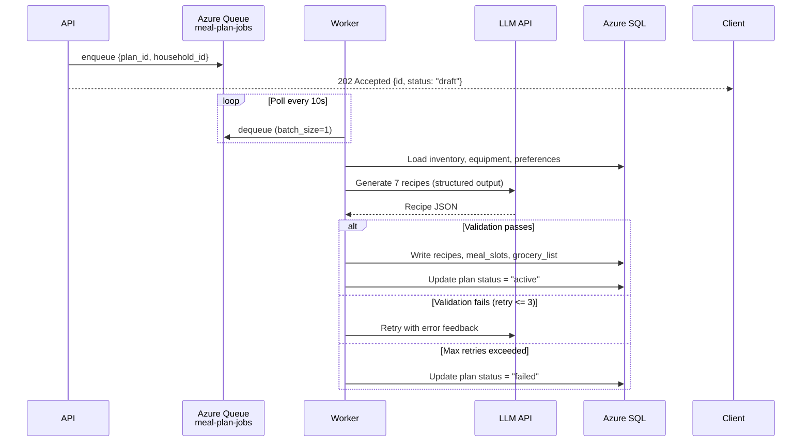
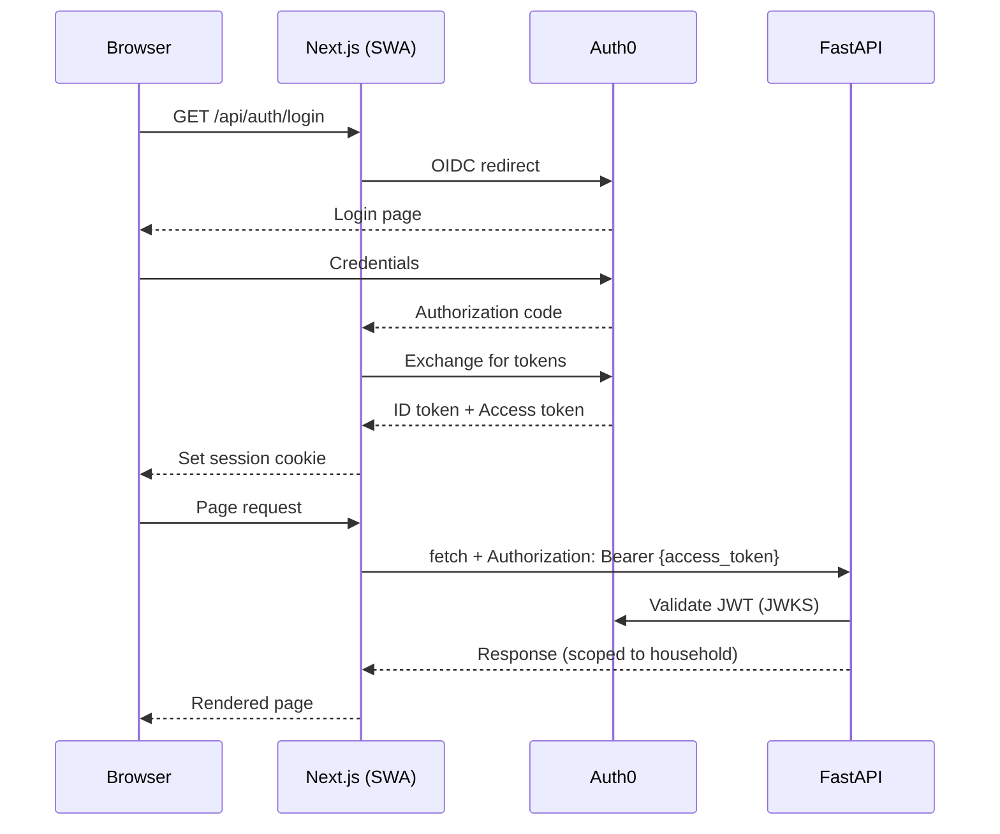
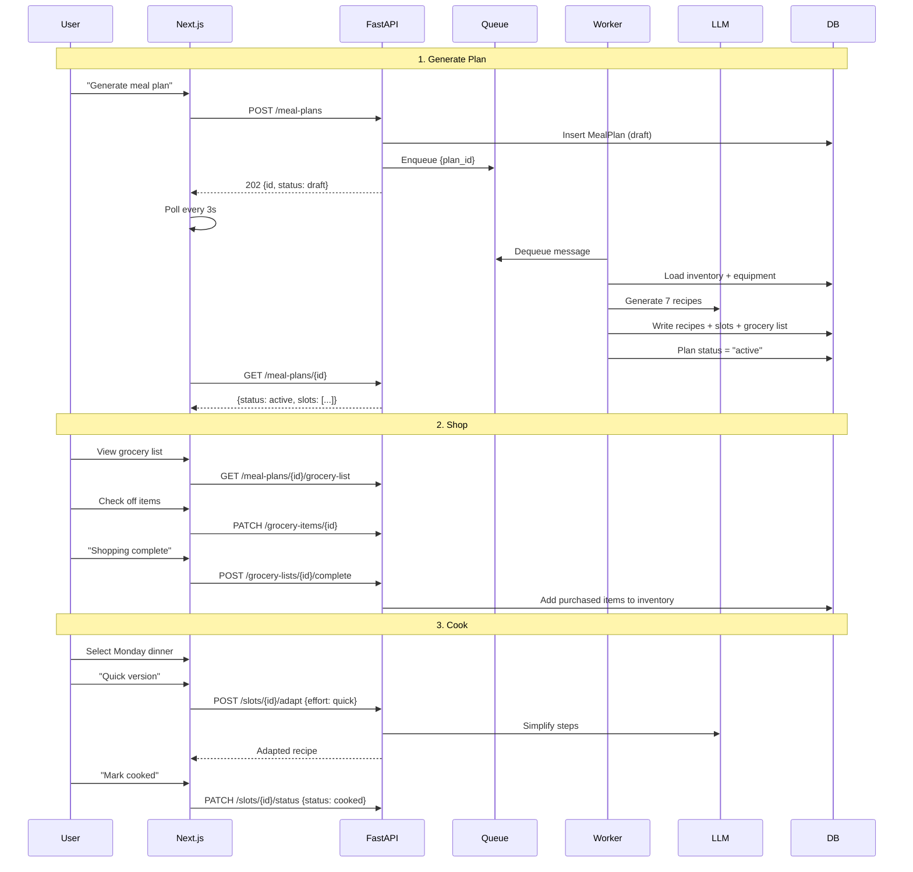

# Design: Meal Planner MVP

## Overview

AI-powered weekly meal planner: Next.js SWA frontend, FastAPI API on AKS, background worker for LLM-based meal plan generation via Azure Queue Storage, Azure SQL for persistence. Follows yt-summarizer patterns exactly -- same project structure, Aspire orchestration, K8s manifests, CI/CD pipeline. MVP covers P1-P4: inventory, AI meal planning, grocery lists, customization.

## Architecture



## Project Structure

```
meal-planner/
├── apps/
│   └── web/                          # Next.js 16 frontend → Azure SWA
│       ├── src/
│       │   ├── app/                   # App Router pages
│       │   │   ├── layout.tsx
│       │   │   ├── page.tsx           # Landing/dashboard
│       │   │   ├── inventory/page.tsx
│       │   │   ├── meal-plan/page.tsx
│       │   │   ├── meal-plan/[id]/page.tsx
│       │   │   ├── grocery-list/[id]/page.tsx
│       │   │   └── api/auth/[auth0]/route.ts  # Auth0 BFF
│       │   ├── components/
│       │   │   ├── inventory/         # InventoryList, AddItemForm, ExpiryBadge
│       │   │   ├── meal-plan/         # WeeklyPlanView, MealSlotCard, SwapDialog
│       │   │   ├── grocery/           # GroceryList, GroceryItem, CompleteDialog
│       │   │   └── ui/               # Shared: Button, Input, Dialog, Badge
│       │   ├── services/              # API client (fetch wrapper + JWT)
│       │   │   └── api.ts
│       │   ├── hooks/                 # useInventory, useMealPlan, useGroceryList
│       │   └── types/                 # TypeScript interfaces matching Pydantic
│       ├── e2e/                       # Playwright E2E tests
│       ├── staticwebapp.config.json
│       ├── next.config.ts
│       ├── tailwind.config.ts
│       └── package.json
├── services/
│   ├── api/                           # FastAPI REST API → AKS
│   │   ├── src/
│   │   │   ├── __init__.py
│   │   │   └── api/
│   │   │       ├── __init__.py
│   │   │       ├── main.py            # FastAPI app factory
│   │   │       ├── middleware/
│   │   │       │   ├── __init__.py
│   │   │       │   ├── correlation.py # Correlation ID middleware
│   │   │       │   └── auth.py        # JWT validation dependency
│   │   │       ├── routes/
│   │   │       │   ├── __init__.py
│   │   │       │   ├── health.py
│   │   │       │   ├── inventory.py
│   │   │       │   ├── equipment.py
│   │   │       │   ├── meal_plans.py
│   │   │       │   ├── grocery.py
│   │   │       │   └── ingredients.py
│   │   │       ├── models/            # Pydantic request/response
│   │   │       │   ├── __init__.py
│   │   │       │   ├── inventory.py
│   │   │       │   ├── equipment.py
│   │   │       │   ├── meal_plan.py
│   │   │       │   ├── grocery.py
│   │   │       │   └── ingredient.py
│   │   │       └── services/          # Business logic
│   │   │           ├── __init__.py
│   │   │           ├── inventory_service.py
│   │   │           ├── equipment_service.py
│   │   │           ├── meal_plan_service.py
│   │   │           ├── grocery_service.py
│   │   │           └── ingredient_service.py
│   │   ├── tests/
│   │   ├── Dockerfile
│   │   └── pyproject.toml
│   ├── workers/                       # Background workers → AKS
│   │   ├── meal_plan_generator/       # LLM meal plan generation
│   │   │   ├── __init__.py
│   │   │   ├── __main__.py            # Entry point (queue poller)
│   │   │   ├── generator.py           # LLM prompt + structured output
│   │   │   ├── validator.py           # Constraint validation
│   │   │   └── prompts.py             # Prompt templates
│   │   ├── worker_utils/              # Shared worker utilities
│   │   ├── tests/
│   │   ├── Dockerfile
│   │   └── pyproject.toml
│   ├── shared/                        # Shared Python package
│   │   ├── shared/
│   │   │   ├── __init__.py
│   │   │   ├── config.py              # Pydantic Settings
│   │   │   ├── db/
│   │   │   │   ├── __init__.py
│   │   │   │   ├── connection.py      # AsyncEngine + session factory
│   │   │   │   └── models/
│   │   │   │       ├── __init__.py
│   │   │   │       ├── base.py        # Base, TimestampMixin, generate_uuid
│   │   │   │       ├── household.py
│   │   │   │       ├── ingredient.py
│   │   │   │       ├── inventory.py
│   │   │   │       ├── equipment.py
│   │   │   │       ├── recipe.py
│   │   │   │       ├── meal_plan.py
│   │   │   │       └── grocery.py
│   │   │   ├── logging/              # structlog config
│   │   │   ├── queue/                # Azure Queue client
│   │   │   └── telemetry/            # OpenTelemetry setup
│   │   ├── alembic/
│   │   │   ├── env.py
│   │   │   └── versions/
│   │   │       └── 001_initial_schema.py
│   │   ├── alembic.ini
│   │   ├── seed/                     # Seed data scripts
│   │   │   ├── ninja_combi_modes.py
│   │   │   └── common_ingredients.py
│   │   └── pyproject.toml
│   └── aspire/                       # .NET Aspire local orchestration
│       └── AppHost/
│           ├── AppHost.cs
│           ├── AppHost.csproj
│           └── appsettings.Development.json
├── infra/
│   └── terraform/                    # App-specific IaC only
│       ├── backend.tf
│       ├── providers.tf
│       ├── variables.tf
│       ├── sql.tf                    # Azure SQL serverless
│       ├── storage.tf               # Storage account + queue
│       ├── swa.tf                   # Static Web App
│       └── key-vault-secrets.tf     # App secrets in shared KV
├── k8s/
│   ├── base/
│   │   ├── kustomization.yaml
│   │   ├── namespace.yaml
│   │   ├── configmap.yaml
│   │   ├── api-deployment.yaml
│   │   ├── api-service.yaml
│   │   ├── api-httproute.yaml
│   │   ├── worker-deployment.yaml
│   │   ├── migration-job.yaml
│   │   ├── externalsecret-db.yaml
│   │   ├── externalsecret-storage.yaml
│   │   ├── externalsecret-llm.yaml
│   │   ├── externalsecret-auth0.yaml
│   │   └── secretstore.yaml
│   └── overlays/
│       ├── prod/
│       └── preview/
├── .github/
│   └── workflows/                    # CI/CD (adapted from yt-summarizer)
├── scripts/                          # CI helpers
└── docs/
```

## Database Schema

All models follow yt-summarizer patterns: `Base` + `TimestampMixin`, `UNIQUEIDENTIFIER` PKs, `mapped_column`, explicit indexes.

### base.py (identical to yt-summarizer)

```python
"""SQLAlchemy Base model and common utilities."""
from datetime import datetime
from uuid import UUID, uuid4

from sqlalchemy import DateTime, func
from sqlalchemy.dialects.mssql import UNIQUEIDENTIFIER
from sqlalchemy.orm import DeclarativeBase, Mapped, mapped_column


class Base(DeclarativeBase):
    type_annotation_map = {UUID: UNIQUEIDENTIFIER}


class TimestampMixin:
    created_at: Mapped[datetime] = mapped_column(
        DateTime, default=func.sysutcdatetime(), nullable=False,
    )
    updated_at: Mapped[datetime] = mapped_column(
        DateTime,
        default=func.sysutcdatetime(),
        onupdate=func.sysutcdatetime(),
        nullable=False,
    )


def generate_uuid() -> UUID:
    return uuid4()
```

### household.py

```python
"""Household and HouseholdMember models."""
from uuid import UUID

from sqlalchemy import Index, Integer, String
from sqlalchemy.orm import Mapped, mapped_column, relationship

from .base import Base, TimestampMixin, generate_uuid


class Household(Base, TimestampMixin):
    __tablename__ = "Households"

    id: Mapped[UUID] = mapped_column(
        primary_key=True, default=generate_uuid,
    )
    name: Mapped[str] = mapped_column(String(200), nullable=False)
    default_servings: Mapped[int] = mapped_column(
        Integer, default=2, nullable=False,
    )

    members: Mapped[list["HouseholdMember"]] = relationship(
        "HouseholdMember", back_populates="household", lazy="selectin",
    )


class HouseholdMember(Base, TimestampMixin):
    __tablename__ = "HouseholdMembers"

    id: Mapped[UUID] = mapped_column(
        primary_key=True, default=generate_uuid,
    )
    household_id: Mapped[UUID] = mapped_column(
        ForeignKey("Households.id"), nullable=False,
    )
    auth0_user_id: Mapped[str] = mapped_column(
        String(100), unique=True, nullable=False,
    )
    display_name: Mapped[str] = mapped_column(
        String(200), nullable=False,
    )
    role: Mapped[str] = mapped_column(
        String(20), default="owner", nullable=False,
    )

    household: Mapped["Household"] = relationship(
        "Household", back_populates="members",
    )

    __table_args__ = (
        Index("ix_members_auth0", "auth0_user_id"),
        Index("ix_members_household", "household_id"),
    )
```

### ingredient.py

```python
"""Ingredient reference entity."""
from uuid import UUID

from sqlalchemy import Index, Integer, String
from sqlalchemy.orm import Mapped, mapped_column

from .base import Base, TimestampMixin, generate_uuid


class Ingredient(Base, TimestampMixin):
    __tablename__ = "Ingredients"

    id: Mapped[UUID] = mapped_column(
        primary_key=True, default=generate_uuid,
    )
    name: Mapped[str] = mapped_column(
        String(200), unique=True, nullable=False,
    )
    category: Mapped[str] = mapped_column(
        String(100), nullable=False,
    )  # produce, dairy, meat, pantry, etc.
    default_unit: Mapped[str] = mapped_column(
        String(10), nullable=False,
    )  # g, ml, units
    default_storage: Mapped[str] = mapped_column(
        String(20), nullable=False,
    )  # fridge, pantry
    typical_shelf_life_days: Mapped[int | None] = mapped_column(
        Integer, nullable=True,
    )

    __table_args__ = (
        Index("ix_ingredients_name", "name"),
        Index("ix_ingredients_category", "category"),
    )
```

### inventory.py

```python
"""InventoryItem model."""
from datetime import datetime
from uuid import UUID

from sqlalchemy import (
    DateTime, Float, ForeignKey, Index, String,
    CheckConstraint,
)
from sqlalchemy.orm import Mapped, mapped_column, relationship

from .base import Base, TimestampMixin, generate_uuid


class InventoryItem(Base, TimestampMixin):
    __tablename__ = "InventoryItems"

    id: Mapped[UUID] = mapped_column(
        primary_key=True, default=generate_uuid,
    )
    household_id: Mapped[UUID] = mapped_column(
        ForeignKey("Households.id"), nullable=False,
    )
    ingredient_id: Mapped[UUID] = mapped_column(
        ForeignKey("Ingredients.id"), nullable=False,
    )
    quantity: Mapped[float] = mapped_column(
        Float, nullable=False,
    )
    unit: Mapped[str] = mapped_column(
        String(10), nullable=False,
    )  # g, ml, units
    location: Mapped[str] = mapped_column(
        String(20), nullable=False,
    )  # fridge, pantry
    expiry_date: Mapped[datetime | None] = mapped_column(
        DateTime, nullable=True,
    )

    ingredient: Mapped["Ingredient"] = relationship(
        "Ingredient", lazy="selectin",
    )

    __table_args__ = (
        CheckConstraint("quantity >= 0", name="ck_inventory_qty"),
        Index("ix_inventory_household", "household_id"),
        Index("ix_inventory_ingredient", "ingredient_id"),
        Index("ix_inventory_expiry", "expiry_date"),
    )
```

### equipment.py

```python
"""Equipment and EquipmentMode models."""
from uuid import UUID

from sqlalchemy import (
    Boolean, Float, ForeignKey, Index, String,
)
from sqlalchemy.orm import Mapped, mapped_column, relationship

from .base import Base, TimestampMixin, generate_uuid


class Equipment(Base, TimestampMixin):
    __tablename__ = "Equipment"

    id: Mapped[UUID] = mapped_column(
        primary_key=True, default=generate_uuid,
    )
    household_id: Mapped[UUID] = mapped_column(
        ForeignKey("Households.id"), nullable=False,
    )
    name: Mapped[str] = mapped_column(
        String(200), nullable=False,
    )
    is_active: Mapped[bool] = mapped_column(
        Boolean, default=True, nullable=False,
    )

    modes: Mapped[list["EquipmentMode"]] = relationship(
        "EquipmentMode", back_populates="equipment",
        lazy="selectin",
    )

    __table_args__ = (
        Index("ix_equipment_household", "household_id"),
    )


class EquipmentMode(Base):
    __tablename__ = "EquipmentModes"

    id: Mapped[UUID] = mapped_column(
        primary_key=True, default=generate_uuid,
    )
    equipment_id: Mapped[UUID] = mapped_column(
        ForeignKey("Equipment.id"), nullable=False,
    )
    name: Mapped[str] = mapped_column(
        String(100), nullable=False,
    )
    category: Mapped[str] = mapped_column(
        String(50), nullable=False,
    )  # air, combi, slow, steam, etc.
    min_temp: Mapped[float | None] = mapped_column(
        Float, nullable=True,
    )  # Celsius
    max_temp: Mapped[float | None] = mapped_column(
        Float, nullable=True,
    )

    equipment: Mapped["Equipment"] = relationship(
        "Equipment", back_populates="modes",
    )

    __table_args__ = (
        Index("ix_modes_equipment", "equipment_id"),
    )
```

### recipe.py

```python
"""Recipe, RecipeIngredient, RecipeStep models."""
from uuid import UUID

from sqlalchemy import (
    Boolean, Float, ForeignKey, Index, Integer,
    String, Text,
)
from sqlalchemy.orm import Mapped, mapped_column, relationship

from .base import Base, TimestampMixin, generate_uuid


class Recipe(Base, TimestampMixin):
    __tablename__ = "Recipes"

    id: Mapped[UUID] = mapped_column(
        primary_key=True, default=generate_uuid,
    )
    household_id: Mapped[UUID | None] = mapped_column(
        ForeignKey("Households.id"), nullable=True,
    )  # NULL = AI-generated, not yet saved as variation
    title: Mapped[str] = mapped_column(
        String(300), nullable=False,
    )
    description: Mapped[str | None] = mapped_column(
        Text, nullable=True,
    )
    servings: Mapped[int] = mapped_column(
        Integer, default=2, nullable=False,
    )
    prep_time_min: Mapped[int | None] = mapped_column(
        Integer, nullable=True,
    )
    cook_time_min: Mapped[int | None] = mapped_column(
        Integer, nullable=True,
    )
    is_ai_generated: Mapped[bool] = mapped_column(
        Boolean, default=True, nullable=False,
    )
    source_recipe_id: Mapped[UUID | None] = mapped_column(
        ForeignKey("Recipes.id"), nullable=True,
    )  # Self-ref for cook-time variations

    ingredients: Mapped[list["RecipeIngredient"]] = relationship(
        "RecipeIngredient", back_populates="recipe",
        lazy="selectin", cascade="all, delete-orphan",
    )
    steps: Mapped[list["RecipeStep"]] = relationship(
        "RecipeStep", back_populates="recipe",
        lazy="selectin", cascade="all, delete-orphan",
        order_by="RecipeStep.step_order",
    )

    __table_args__ = (
        Index("ix_recipes_household", "household_id"),
    )


class RecipeIngredient(Base):
    __tablename__ = "RecipeIngredients"

    id: Mapped[UUID] = mapped_column(
        primary_key=True, default=generate_uuid,
    )
    recipe_id: Mapped[UUID] = mapped_column(
        ForeignKey("Recipes.id"), nullable=False,
    )
    ingredient_id: Mapped[UUID] = mapped_column(
        ForeignKey("Ingredients.id"), nullable=False,
    )
    quantity: Mapped[float] = mapped_column(
        Float, nullable=False,
    )
    unit: Mapped[str] = mapped_column(
        String(10), nullable=False,
    )
    is_optional: Mapped[bool] = mapped_column(
        Boolean, default=False, nullable=False,
    )

    recipe: Mapped["Recipe"] = relationship(
        "Recipe", back_populates="ingredients",
    )
    ingredient: Mapped["Ingredient"] = relationship(
        "Ingredient", lazy="selectin",
    )

    __table_args__ = (
        Index("ix_recipe_ing_recipe", "recipe_id"),
        Index("ix_recipe_ing_ingredient", "ingredient_id"),
    )


class RecipeStep(Base):
    __tablename__ = "RecipeSteps"

    id: Mapped[UUID] = mapped_column(
        primary_key=True, default=generate_uuid,
    )
    recipe_id: Mapped[UUID] = mapped_column(
        ForeignKey("Recipes.id"), nullable=False,
    )
    step_order: Mapped[int] = mapped_column(
        Integer, nullable=False,
    )
    instruction: Mapped[str] = mapped_column(
        Text, nullable=False,
    )
    equipment_mode_id: Mapped[UUID | None] = mapped_column(
        ForeignKey("EquipmentModes.id"), nullable=True,
    )  # NULL = prep step (no equipment)
    temperature: Mapped[float | None] = mapped_column(
        Float, nullable=True,
    )  # Celsius
    duration_min: Mapped[int | None] = mapped_column(
        Integer, nullable=True,
    )

    recipe: Mapped["Recipe"] = relationship(
        "Recipe", back_populates="steps",
    )
    equipment_mode: Mapped["EquipmentMode | None"] = relationship(
        "EquipmentMode", lazy="selectin",
    )

    __table_args__ = (
        Index("ix_steps_recipe", "recipe_id"),
    )
```

### meal_plan.py

```python
"""MealPlan and MealSlot models."""
from datetime import datetime
from uuid import UUID

from sqlalchemy import (
    DateTime, ForeignKey, Index, Integer, String,
    UniqueConstraint,
)
from sqlalchemy.orm import Mapped, mapped_column, relationship

from .base import Base, TimestampMixin, generate_uuid


class MealPlan(Base, TimestampMixin):
    __tablename__ = "MealPlans"

    id: Mapped[UUID] = mapped_column(
        primary_key=True, default=generate_uuid,
    )
    household_id: Mapped[UUID] = mapped_column(
        ForeignKey("Households.id"), nullable=False,
    )
    week_start_date: Mapped[datetime] = mapped_column(
        DateTime, nullable=False,
    )  # Always a Monday
    status: Mapped[str] = mapped_column(
        String(20), default="draft", nullable=False,
    )  # draft, active, completed
    error_message: Mapped[str | None] = mapped_column(
        String(1000), nullable=True,
    )

    slots: Mapped[list["MealSlot"]] = relationship(
        "MealSlot", back_populates="meal_plan",
        lazy="selectin", cascade="all, delete-orphan",
    )
    grocery_list: Mapped["GroceryList | None"] = relationship(
        "GroceryList", back_populates="meal_plan",
        lazy="selectin", uselist=False,
    )

    __table_args__ = (
        Index("ix_plans_household", "household_id"),
        Index("ix_plans_status", "status"),
        Index("ix_plans_week", "week_start_date"),
    )


class MealSlot(Base, TimestampMixin):
    __tablename__ = "MealSlots"

    id: Mapped[UUID] = mapped_column(
        primary_key=True, default=generate_uuid,
    )
    meal_plan_id: Mapped[UUID] = mapped_column(
        ForeignKey("MealPlans.id"), nullable=False,
    )
    recipe_id: Mapped[UUID | None] = mapped_column(
        ForeignKey("Recipes.id"), nullable=True,
    )
    day: Mapped[int] = mapped_column(
        Integer, nullable=False,
    )  # 1=Mon, 7=Sun
    meal_type: Mapped[str] = mapped_column(
        String(20), nullable=False,
    )  # breakfast, lunch, dinner
    status: Mapped[str] = mapped_column(
        String(20), default="planned", nullable=False,
    )  # planned, cooked, skipped
    cooked_at: Mapped[datetime | None] = mapped_column(
        DateTime, nullable=True,
    )

    meal_plan: Mapped["MealPlan"] = relationship(
        "MealPlan", back_populates="slots",
    )
    recipe: Mapped["Recipe | None"] = relationship(
        "Recipe", lazy="selectin",
    )

    __table_args__ = (
        UniqueConstraint(
            "meal_plan_id", "day", "meal_type",
            name="uq_slot_plan_day_type",
        ),
        Index("ix_slots_plan", "meal_plan_id"),
    )
```

### grocery.py

```python
"""GroceryList and GroceryItem models."""
from uuid import UUID

from sqlalchemy import (
    Boolean, Float, ForeignKey, Index, String,
)
from sqlalchemy.orm import Mapped, mapped_column, relationship

from .base import Base, TimestampMixin, generate_uuid


class GroceryList(Base, TimestampMixin):
    __tablename__ = "GroceryLists"

    id: Mapped[UUID] = mapped_column(
        primary_key=True, default=generate_uuid,
    )
    meal_plan_id: Mapped[UUID] = mapped_column(
        ForeignKey("MealPlans.id"), unique=True, nullable=False,
    )

    meal_plan: Mapped["MealPlan"] = relationship(
        "MealPlan", back_populates="grocery_list",
    )
    items: Mapped[list["GroceryItem"]] = relationship(
        "GroceryItem", back_populates="grocery_list",
        lazy="selectin", cascade="all, delete-orphan",
    )

    __table_args__ = (
        Index("ix_grocery_plan", "meal_plan_id"),
    )


class GroceryItem(Base):
    __tablename__ = "GroceryItems"

    id: Mapped[UUID] = mapped_column(
        primary_key=True, default=generate_uuid,
    )
    grocery_list_id: Mapped[UUID] = mapped_column(
        ForeignKey("GroceryLists.id"), nullable=False,
    )
    ingredient_id: Mapped[UUID] = mapped_column(
        ForeignKey("Ingredients.id"), nullable=False,
    )
    quantity_needed: Mapped[float] = mapped_column(
        Float, nullable=False,
    )
    unit: Mapped[str] = mapped_column(
        String(10), nullable=False,
    )
    is_checked: Mapped[bool] = mapped_column(
        Boolean, default=False, nullable=False,
    )
    preferred_store: Mapped[str | None] = mapped_column(
        String(100), nullable=True,
    )

    grocery_list: Mapped["GroceryList"] = relationship(
        "GroceryList", back_populates="items",
    )
    ingredient: Mapped["Ingredient"] = relationship(
        "Ingredient", lazy="selectin",
    )

    __table_args__ = (
        Index("ix_grocery_items_list", "grocery_list_id"),
        Index("ix_grocery_items_ingredient", "ingredient_id"),
    )
```

### models/**init**.py

```python
"""SQLAlchemy database models for Meal Planner."""
from .base import Base, TimestampMixin, generate_uuid
from .household import Household, HouseholdMember
from .ingredient import Ingredient
from .inventory import InventoryItem
from .equipment import Equipment, EquipmentMode
from .recipe import Recipe, RecipeIngredient, RecipeStep
from .meal_plan import MealPlan, MealSlot
from .grocery import GroceryList, GroceryItem

__all__ = [
    "Base", "TimestampMixin", "generate_uuid",
    "Household", "HouseholdMember",
    "Ingredient",
    "InventoryItem",
    "Equipment", "EquipmentMode",
    "Recipe", "RecipeIngredient", "RecipeStep",
    "MealPlan", "MealSlot",
    "GroceryList", "GroceryItem",
]
```

## API Design

### Endpoints

| #   | Method | Path                                           | Purpose                  | Status | Request               | Response                  |
| --- | ------ | ---------------------------------------------- | ------------------------ | ------ | --------------------- | ------------------------- |
| 1   | GET    | /api/v1/inventory                              | List household inventory | 200    | query: location?      | `InventoryItemResponse[]` |
| 2   | POST   | /api/v1/inventory                              | Add inventory item       | 201    | `CreateInventoryItem` | `InventoryItemResponse`   |
| 3   | PATCH  | /api/v1/inventory/{id}                         | Update qty/expiry        | 200    | `UpdateInventoryItem` | `InventoryItemResponse`   |
| 4   | DELETE | /api/v1/inventory/{id}                         | Remove item              | 204    | -                     | -                         |
| 5   | GET    | /api/v1/equipment                              | List equipment + modes   | 200    | -                     | `EquipmentResponse[]`     |
| 6   | POST   | /api/v1/equipment                              | Register equipment       | 201    | `CreateEquipment`     | `EquipmentResponse`       |
| 7   | POST   | /api/v1/meal-plans                             | Generate plan (async)    | 202    | `CreateMealPlan`      | `MealPlanResponse`        |
| 8   | GET    | /api/v1/meal-plans/{id}                        | Get plan + recipes       | 200    | -                     | `MealPlanDetailResponse`  |
| 9   | GET    | /api/v1/meal-plans/active                      | Get active plan          | 200    | -                     | `MealPlanDetailResponse`  |
| 10  | PATCH  | /api/v1/meal-plans/{id}/status                 | Activate/complete plan   | 200    | `UpdatePlanStatus`    | `MealPlanResponse`        |
| 11  | PATCH  | /api/v1/meal-plans/{id}/slots/{slot_id}        | Swap/modify slot         | 200    | `UpdateMealSlot`      | `MealSlotResponse`        |
| 12  | POST   | /api/v1/meal-plans/{id}/slots/{slot_id}/adapt  | Cook-time adapt          | 200    | `AdaptRequest`        | `RecipeResponse`          |
| 13  | PATCH  | /api/v1/meal-plans/{id}/slots/{slot_id}/status | Mark cooked/skipped      | 200    | `UpdateSlotStatus`    | `MealSlotResponse`        |
| 14  | POST   | /api/v1/recipes/{id}/save-variation            | Save cook-time variation | 201    | -                     | `RecipeResponse`          |
| 15  | GET    | /api/v1/meal-plans/{id}/grocery-list           | Get grocery list         | 200    | -                     | `GroceryListResponse`     |
| 16  | PATCH  | /api/v1/grocery-items/{id}                     | Check/uncheck item       | 200    | `UpdateGroceryItem`   | `GroceryItemResponse`     |
| 17  | POST   | /api/v1/grocery-lists/{id}/complete            | Complete shopping        | 200    | `CompleteShoppingReq` | `InventoryItemResponse[]` |
| 18  | GET    | /api/v1/ingredients                            | Search/autocomplete      | 200    | query: q, limit?      | `IngredientResponse[]`    |
| 19  | GET    | /health/live                                   | Liveness probe           | 200    | -                     | `{"status": "ok"}`        |
| 20  | GET    | /health/ready                                  | Readiness probe          | 200    | -                     | `ReadinessStatus`         |

All endpoints except health probes require JWT (Auth0). Household scoping enforced via `get_current_household_id()` dependency.

### Key Pydantic Models

```python
# --- Inventory ---
class CreateInventoryItem(BaseModel):
    ingredient_id: UUID
    quantity: float = Field(gt=0)
    unit: Literal["g", "ml", "units"]
    location: Literal["fridge", "pantry"]
    expiry_date: datetime | None = None

class UpdateInventoryItem(BaseModel):
    quantity: float | None = Field(default=None, gt=0)
    expiry_date: datetime | None = None

class InventoryItemResponse(BaseModel):
    id: UUID
    ingredient: IngredientResponse
    quantity: float
    unit: str
    location: str
    expiry_date: datetime | None
    expiry_status: Literal["safe", "expiring", "expired"]
    created_at: datetime

# --- Meal Plan ---
class CreateMealPlan(BaseModel):
    week_start_date: datetime  # Must be Monday

class MealPlanDetailResponse(BaseModel):
    id: UUID
    week_start_date: datetime
    status: str
    slots: list[MealSlotResponse]
    grocery_list: GroceryListResponse | None
    created_at: datetime

class AdaptRequest(BaseModel):
    effort_level: Literal["quick", "standard", "elaborate"]

# --- Grocery ---
class CompleteShoppingRequest(BaseModel):
    purchased_items: list[PurchasedItem]

class PurchasedItem(BaseModel):
    grocery_item_id: UUID
    expiry_date: datetime | None = None
```

### Auth Middleware

```python
# services/api/src/api/middleware/auth.py
from fastapi import Depends, HTTPException, Request
from jose import jwt, JWTError
import httpx

async def get_current_user(request: Request) -> dict:
    """Extract and validate JWT from Authorization header."""
    token = request.headers.get("Authorization", "").replace(
        "Bearer ", ""
    )
    if not token:
        raise HTTPException(401, "Missing token")
    # Validate against Auth0 JWKS
    payload = validate_jwt(token)
    return payload

async def get_current_household_id(
    user: dict = Depends(get_current_user),
    session: AsyncSession = Depends(get_session),
) -> UUID:
    """Resolve Auth0 user to household_id. Auto-create on first login."""
    auth0_id = user["sub"]
    member = await session.execute(
        select(HouseholdMember).where(
            HouseholdMember.auth0_user_id == auth0_id
        )
    )
    member = member.scalar_one_or_none()
    if not member:
        # Auto-provision household + member on first login
        household = Household(name="My Kitchen")
        session.add(household)
        await session.flush()
        member = HouseholdMember(
            household_id=household.id,
            auth0_user_id=auth0_id,
            display_name=user.get("name", "User"),
        )
        session.add(member)
        await session.commit()
    return member.household_id
```

### Error Handling

Follows yt-summarizer pattern: structured error JSON with correlation ID.

```python
{
    "error": {
        "code": 404,
        "message": "Inventory item not found",
        "correlation_id": "abc-123"
    }
}
```

| Error Scenario         | Status | Message                                    |
| ---------------------- | ------ | ------------------------------------------ |
| Item not found         | 404    | Resource-specific message                  |
| Validation failure     | 422    | Pydantic field errors                      |
| Unauthorized           | 401    | Missing/invalid token                      |
| Cross-household access | 404    | Returns 404 (not 403) to avoid enumeration |
| Plan already active    | 409    | "Active plan already exists"               |
| LLM generation failed  | 500    | Error stored on MealPlan.error_message     |

## Worker Design: Meal Plan Generator

### Queue Polling Architecture

Follows yt-summarizer worker pattern: `__main__.py` entry point, polls Azure Queue Storage, processes messages.



### Worker Entry Point

```python
# services/workers/meal_plan_generator/__main__.py
"""Meal plan generation worker."""
import asyncio
from shared.config import get_settings
from shared.queue.client import get_queue_client
from shared.logging.config import configure_logging, get_logger
from .generator import generate_meal_plan

logger = get_logger(__name__)
QUEUE_NAME = "meal-plan-jobs"
POLL_INTERVAL = float(os.environ.get("QUEUE_POLL_INTERVAL", "10.0"))

async def main():
    configure_logging(service_name="meal-plan-worker")
    queue_client = get_queue_client()
    queue_client.ensure_queue(QUEUE_NAME)
    logger.info("worker_started", queue=QUEUE_NAME)

    while True:
        messages = queue_client.receive_messages(
            QUEUE_NAME, max_messages=1, visibility_timeout=120,
        )
        for msg in messages:
            try:
                await generate_meal_plan(msg.content)
                queue_client.delete_message(QUEUE_NAME, msg)
                logger.info("plan_generated", message_id=msg.id)
            except Exception as e:
                logger.error("plan_generation_failed", error=str(e))
                # Message becomes visible again after timeout
        await asyncio.sleep(POLL_INTERVAL)

if __name__ == "__main__":
    asyncio.run(main())
```

### LLM Integration

```python
# services/workers/meal_plan_generator/generator.py
"""LLM-based meal plan generation with constraint validation."""
import json
from pydantic import BaseModel

class GeneratedRecipe(BaseModel):
    """Pydantic model for LLM structured output."""
    title: str
    description: str
    prep_time_min: int
    cook_time_min: int
    servings: int = 2
    ingredients: list[RecipeIngredientSchema]
    steps: list[RecipeStepSchema]

class RecipeIngredientSchema(BaseModel):
    ingredient_name: str  # Matched to Ingredient entity
    quantity: float
    unit: str  # g, ml, units
    is_optional: bool = False

class RecipeStepSchema(BaseModel):
    step_order: int
    instruction: str
    equipment_name: str | None = None  # "Ninja Combi", "Stove"
    equipment_mode: str | None = None  # "Air Crisp", "Sear/Saute"
    temperature: float | None = None
    duration_min: int | None = None

class GeneratedMealPlan(BaseModel):
    recipes: list[GeneratedRecipe]  # Exactly 7

async def generate_meal_plan(message_content: str):
    data = json.loads(message_content)
    plan_id = data["plan_id"]
    household_id = data["household_id"]

    # 1. Load context from DB
    inventory = await load_inventory(household_id)
    equipment = await load_equipment(household_id)
    expiring = sorted(
        [i for i in inventory if i.expiry_date],
        key=lambda x: x.expiry_date,
    )

    # 2. Build prompt
    prompt = build_prompt(inventory, equipment, expiring)

    # 3. Call LLM with structured output
    max_retries = 3
    for attempt in range(max_retries):
        raw = await call_llm(prompt)
        try:
            plan = GeneratedMealPlan.model_validate_json(raw)
            errors = validate_constraints(plan, inventory, equipment)
            if not errors:
                break
            prompt = add_error_feedback(prompt, errors)
        except ValidationError as e:
            if attempt == max_retries - 1:
                await mark_plan_failed(plan_id, str(e))
                return
            prompt = add_error_feedback(prompt, str(e))

    # 4. Write to DB
    await persist_plan(plan_id, plan, household_id)
```

### Constraint Validation

```python
# services/workers/meal_plan_generator/validator.py
def validate_constraints(
    plan: GeneratedMealPlan,
    inventory: list,
    equipment: list,
) -> list[str]:
    errors = []
    equipment_modes = {
        m.name.lower() for e in equipment for m in e.modes
    }

    for i, recipe in enumerate(plan.recipes):
        # Check servings
        if recipe.servings != 2:
            errors.append(
                f"Recipe {i}: servings={recipe.servings}, expected 2"
            )
        # Check equipment modes exist
        for step in recipe.steps:
            if step.equipment_mode:
                if step.equipment_mode.lower() not in equipment_modes:
                    errors.append(
                        f"Recipe {i} step {step.step_order}: "
                        f"unknown mode '{step.equipment_mode}'"
                    )
        # Check exactly 7 recipes
    if len(plan.recipes) != 7:
        errors.append(
            f"Expected 7 recipes, got {len(plan.recipes)}"
        )
    return errors
```

### Prompt Engineering

```python
# services/workers/meal_plan_generator/prompts.py
SYSTEM_PROMPT = """You are a meal planning assistant. Generate a
7-day dinner plan for 2 adults.

RULES:
1. Prioritize ingredients expiring soonest (use them Mon-Wed)
2. Each recipe: 2 servings, realistic prep/cook times
3. Equipment-specific steps with mode, temperature, duration
4. Respond ONLY with valid JSON matching the schema
5. Use ingredient names that match the provided inventory list
6. Every recipe must have at least one step

OUTPUT SCHEMA:
{schema_json}
"""

def build_prompt(inventory, equipment, expiring):
    schema = GeneratedMealPlan.model_json_schema()
    equipment_info = format_equipment(equipment)
    inventory_info = format_inventory(inventory)
    expiring_info = format_expiring(expiring)

    return f"""{SYSTEM_PROMPT.format(schema_json=json.dumps(schema))}

AVAILABLE EQUIPMENT:
{equipment_info}

CURRENT INVENTORY (use these first):
{inventory_info}

EXPIRING SOON (prioritize these):
{expiring_info}

Generate the meal plan JSON now."""
```

### Cook-Time Adaptation (Synchronous)

Cook-time adaptation (AC-4.3, AC-4.4) is synchronous via the API (not the worker), using a direct LLM call since it must complete in <10s.

```python
# services/api/src/api/services/meal_plan_service.py
async def adapt_recipe(
    recipe: Recipe,
    effort_level: str,  # "quick", "standard", "elaborate"
    equipment: list[Equipment],
) -> Recipe:
    """Adapt recipe steps based on effort level. Direct LLM call."""
    prompt = build_adaptation_prompt(recipe, effort_level, equipment)
    adapted = await call_llm(prompt, timeout=8)
    # Returns modified steps only, same ingredients
    return merge_adapted_steps(recipe, adapted)
```

## Frontend Architecture

### Pages (App Router)

| Route                | Page        | Purpose                                         |
| -------------------- | ----------- | ----------------------------------------------- |
| `/`                  | Dashboard   | Show active plan summary, expiring items count  |
| `/inventory`         | Inventory   | List items grouped by location, add/edit/remove |
| `/meal-plan`         | Plan list   | Create new plan, view current/past plans        |
| `/meal-plan/[id]`    | Plan detail | Weekly list view, swap meals, mark cooked       |
| `/grocery-list/[id]` | Grocery     | Checklist, complete shopping flow               |
| `/api/auth/[auth0]`  | Auth BFF    | Auth0 login/logout/callback (server route)      |

### Key Components

```
components/
├── inventory/
│   ├── InventoryList.tsx       # Grouped by location, sorted by expiry
│   ├── AddItemForm.tsx         # Ingredient autocomplete + qty + expiry
│   └── ExpiryBadge.tsx         # Red/amber/default based on date
├── meal-plan/
│   ├── WeeklyPlanView.tsx      # List-based (not calendar grid) per research
│   ├── MealSlotCard.tsx        # Recipe title, time, equipment tags
│   ├── SwapDialog.tsx          # Swap between days
│   └── AdaptControls.tsx       # Quick/standard/elaborate buttons
├── grocery/
│   ├── GroceryList.tsx         # Grouped by store, checkboxes
│   ├── GroceryItem.tsx         # Name, qty, checkbox
│   └── CompleteShoppingDialog.tsx  # Expiry date entry for purchases
└── ui/
    ├── Button.tsx
    ├── Input.tsx
    ├── Dialog.tsx
    ├── Badge.tsx
    └── Spinner.tsx
```

### API Client

```typescript
// apps/web/src/services/api.ts
const API_URL = process.env.NEXT_PUBLIC_API_URL;

async function fetchApi<T>(path: string, options?: RequestInit): Promise<T> {
  const res = await fetch(`${API_URL}${path}`, {
    ...options,
    headers: {
      "Content-Type": "application/json",
      ...options?.headers,
    },
  });
  if (!res.ok) {
    const error = await res.json();
    throw new ApiError(error.error.message, res.status);
  }
  return res.json();
}

// Inventory
export const getInventory = () =>
  fetchApi<InventoryItem[]>("/api/v1/inventory");
export const addInventoryItem = (data: CreateInventoryItem) =>
  fetchApi<InventoryItem>("/api/v1/inventory", {
    method: "POST",
    body: JSON.stringify(data),
  });

// Meal Plans
export const createMealPlan = (data: CreateMealPlan) =>
  fetchApi<MealPlan>("/api/v1/meal-plans", {
    method: "POST",
    body: JSON.stringify(data),
  });
export const getMealPlan = (id: string) =>
  fetchApi<MealPlanDetail>(`/api/v1/meal-plans/${id}`);
```

### State Management

No external state library. Use React 19 server components + `use()` for data fetching, client components only where interactivity needed (forms, checkboxes, drag). SWR or React Query only if polling UX for plan generation proves insufficient with simple `setInterval`.

### Polling for Plan Generation

```typescript
// apps/web/src/hooks/useMealPlanPolling.ts
function useMealPlanPolling(planId: string) {
  const [plan, setPlan] = useState<MealPlan | null>(null);

  useEffect(() => {
    const poll = setInterval(async () => {
      const result = await getMealPlan(planId);
      setPlan(result);
      if (result.status !== "draft") clearInterval(poll);
    }, 3000);
    return () => clearInterval(poll);
  }, [planId]);

  return plan;
}
```

## Auth Flow



- Frontend: `@auth0/nextjs-auth0` 4.x BFF pattern (session in server-side cookie)
- API: JWT validation via `python-jose` + Auth0 JWKS endpoint
- Auto-provisioning: first login creates Household + HouseholdMember
- All queries filter by `household_id` -- row-level isolation (NFR-13)

## .NET Aspire Setup

```csharp
// services/aspire/AppHost/AppHost.cs
var builder = DistributedApplication.CreateBuilder(args);

// LLM API Key
var llmApiKey = builder.AddParameter("llm-api-key", secret: true);

// Auth0 configuration
var auth0Domain = builder.AddParameter("auth0-domain", secret: false);
var auth0ClientId = builder.AddParameter("auth0-client-id", secret: false);
var auth0ClientSecret = builder.AddParameter(
    "auth0-client-secret", secret: true
);
var auth0SessionSecret = builder.AddParameter(
    "auth0-session-secret", secret: true
);

// Azure Storage (Azurite emulator for local dev)
var storage = builder.AddAzureStorage("storage")
    .RunAsEmulator(azurite =>
    {
        azurite.WithLifetime(ContainerLifetime.Persistent);
        azurite.WithDataVolume();
    });
var queues = storage.AddQueues("queues");

// SQL Server 2025
var sql = builder.AddSqlServer("sql")
    .WithImageTag("2025-latest")
    .AddDatabase("mealplanner");

// FastAPI API
var api = builder.AddPythonModule("api", "../../api", "uvicorn")
    .WithArgs(
        "src.api.main:app",
        "--host", "0.0.0.0", "--port", "8000", "--reload"
    )
    .WithHttpEndpoint(
        port: 8000, targetPort: 8000,
        name: "http", isProxied: false
    )
    .WithExternalHttpEndpoints()
    .WithReference(queues)
    .WithReference(sql)
    .WithEnvironment("LLM_API_KEY", llmApiKey)
    .WithEnvironment("AUTH0_DOMAIN", auth0Domain)
    .WithEnvironment("AUTH0_CLIENT_ID", auth0ClientId)
    .WithEnvironment("AUTH0_CLIENT_SECRET", auth0ClientSecret)
    .WithEnvironment("AUTH0_SESSION_SECRET", auth0SessionSecret)
    .WithEnvironment("API_BASE_URL", "http://localhost:8000");

// Next.js Frontend
var web = builder.AddNpmApp("web", "../../../apps/web", "dev")
    .WithHttpEndpoint(
        port: 3000, targetPort: 3000,
        name: "http", isProxied: false
    )
    .WithExternalHttpEndpoints()
    .WithEnvironment(
        "NEXT_PUBLIC_API_URL", "http://localhost:8000"
    );

// Meal Plan Generator Worker
var workerPath = Path.GetFullPath(
    Path.Combine(builder.AppHostDirectory,
    "../../workers/meal_plan_generator")
);
var worker = builder.AddExecutable(
        "meal-plan-worker",
        Path.Combine(workerPath, ".venv/Scripts/python.exe"),
        workerPath,
        "__main__.py"
    )
    .WithReference(queues)
    .WithReference(sql)
    .WithEnvironment("LLM_API_KEY", llmApiKey)
    .WithEnvironment("HEALTH_PORT", "8091")
    .WithEnvironment("QUEUE_POLL_INTERVAL", "5.0")
    .WithHttpEndpoint(
        port: 8091, targetPort: 8091,
        name: "health", isProxied: false
    )
    .WithOtlpExporter();

builder.Build().Run();
```

## Infrastructure (App-Specific Terraform)

Only app-specific resources. Shared infra (AKS, ACR, Key Vault, DNS) managed in `AshleyHollis/shared-infra`.

### sql.tf

```hcl
resource "azurerm_mssql_server" "meal_planner" {
  name                         = "sql-meal-planner-prd"
  resource_group_name          = data.azurerm_resource_group.main.name
  location                     = data.azurerm_resource_group.main.location
  version                      = "12.0"
  administrator_login          = "sqladmin"
  administrator_login_password = var.sql_admin_password

  azuread_administrator {
    login_username = "AKS Service Principal"
    object_id      = data.azurerm_kubernetes_cluster.aks.kubelet_identity[0].object_id
  }
}

resource "azurerm_mssql_database" "meal_planner" {
  name      = "meal-planner"
  server_id = azurerm_mssql_server.meal_planner.id
  sku_name  = "GP_S_Gen5_1"  # Serverless General Purpose

  auto_pause_delay_in_minutes = 60
  min_capacity                = 0.5
  max_size_gb                 = 32
}

resource "azurerm_mssql_firewall_rule" "allow_azure" {
  name             = "AllowAzureServices"
  server_id        = azurerm_mssql_server.meal_planner.id
  start_ip_address = "0.0.0.0"
  end_ip_address   = "0.0.0.0"
}
```

### storage.tf

```hcl
resource "azurerm_storage_account" "meal_planner" {
  name                     = "stmealplannerprd"
  resource_group_name      = data.azurerm_resource_group.main.name
  location                 = data.azurerm_resource_group.main.location
  account_tier             = "Standard"
  account_replication_type = "LRS"
}

resource "azurerm_storage_queue" "meal_plan_jobs" {
  name                 = "meal-plan-jobs"
  storage_account_name = azurerm_storage_account.meal_planner.name
}
```

### swa.tf

```hcl
resource "azurerm_static_web_app" "meal_planner" {
  name                = "swa-meal-planner-prd"
  resource_group_name = data.azurerm_resource_group.main.name
  location            = "eastasia"
  sku_tier            = "Free"
  sku_size            = "Free"
}
```

### key-vault-secrets.tf

```hcl
# Store app-specific secrets in shared Key Vault
resource "azurerm_key_vault_secret" "db_connection" {
  name         = "meal-planner-db-connection"
  value        = "Server=tcp:${azurerm_mssql_server.meal_planner.fully_qualified_domain_name},1433;Database=${azurerm_mssql_database.meal_planner.name};User Id=${azurerm_mssql_server.meal_planner.administrator_login};Password=${var.sql_admin_password};Encrypt=yes;TrustServerCertificate=no;"
  key_vault_id = data.azurerm_key_vault.shared.id
}

resource "azurerm_key_vault_secret" "storage_connection" {
  name         = "meal-planner-storage-connection"
  value        = azurerm_storage_account.meal_planner.primary_connection_string
  key_vault_id = data.azurerm_key_vault.shared.id
}
```

## Kubernetes Manifests

### base/kustomization.yaml

```yaml
apiVersion: kustomize.config.k8s.io/v1beta1
kind: Kustomization

namespace: meal-planner

resources:
  - namespace.yaml
  - configmap.yaml
  - api-deployment.yaml
  - api-service.yaml
  - api-httproute.yaml
  - worker-deployment.yaml
  - migration-job.yaml
  - externalsecret-db.yaml
  - externalsecret-storage.yaml
  - externalsecret-llm.yaml
  - externalsecret-auth0.yaml
  - secretstore.yaml

labels:
  - pairs:
      app.kubernetes.io/managed-by: kustomize
```

### base/api-deployment.yaml

```yaml
apiVersion: apps/v1
kind: Deployment
metadata:
  name: api
  namespace: meal-planner
  labels:
    app.kubernetes.io/name: api
    app.kubernetes.io/component: backend
    app.kubernetes.io/part-of: meal-planner
  annotations:
    argocd.argoproj.io/sync-wave: "2"
spec:
  replicas: 1
  selector:
    matchLabels:
      app.kubernetes.io/name: api
  template:
    metadata:
      labels:
        app.kubernetes.io/name: api
        app.kubernetes.io/component: backend
        app.kubernetes.io/part-of: meal-planner
    spec:
      serviceAccountName: meal-planner-sa
      containers:
        - name: api
          image: meal-planner-api
          imagePullPolicy: Always
          ports:
            - name: http
              containerPort: 8000
              protocol: TCP
          env:
            - name: API_PORT
              value: "8000"
            - name: ENVIRONMENT
              valueFrom:
                configMapKeyRef:
                  name: meal-planner-config
                  key: ENVIRONMENT
            - name: DATABASE_URL
              valueFrom:
                secretKeyRef:
                  name: db-credentials
                  key: connection-string
            - name: AZURE_STORAGE_CONNECTION_STRING
              valueFrom:
                secretKeyRef:
                  name: storage-credentials
                  key: connection-string
            - name: LLM_API_KEY
              valueFrom:
                secretKeyRef:
                  name: llm-credentials
                  key: api-key
            - name: AUTH0_DOMAIN
              valueFrom:
                secretKeyRef:
                  name: auth0-credentials
                  key: domain
            - name: AUTH0_CLIENT_ID
              valueFrom:
                secretKeyRef:
                  name: auth0-credentials
                  key: client-id
            - name: AUTH0_CLIENT_SECRET
              valueFrom:
                secretKeyRef:
                  name: auth0-credentials
                  key: client-secret
          resources:
            requests:
              cpu: 100m
              memory: 256Mi
            limits:
              cpu: 500m
              memory: 512Mi
          startupProbe:
            httpGet:
              path: /health/live
              port: http
            periodSeconds: 5
            failureThreshold: 30
          readinessProbe:
            httpGet:
              path: /health/ready
              port: http
            initialDelaySeconds: 15
            periodSeconds: 5
            failureThreshold: 6
          livenessProbe:
            httpGet:
              path: /health/live
              port: http
            initialDelaySeconds: 30
            periodSeconds: 30
            failureThreshold: 3
      restartPolicy: Always
```

### base/worker-deployment.yaml

```yaml
apiVersion: apps/v1
kind: Deployment
metadata:
  name: meal-plan-worker
  namespace: meal-planner
  labels:
    app.kubernetes.io/name: meal-plan-worker
    app.kubernetes.io/component: worker
    app.kubernetes.io/part-of: meal-planner
  annotations:
    argocd.argoproj.io/sync-wave: "3"
spec:
  replicas: 1
  selector:
    matchLabels:
      app.kubernetes.io/name: meal-plan-worker
  template:
    metadata:
      labels:
        app.kubernetes.io/name: meal-plan-worker
        app.kubernetes.io/component: worker
        app.kubernetes.io/part-of: meal-planner
    spec:
      serviceAccountName: meal-planner-sa
      containers:
        - name: worker
          image: meal-planner-worker
          imagePullPolicy: Always
          ports:
            - name: health
              containerPort: 8091
              protocol: TCP
          env:
            - name: DATABASE_URL
              valueFrom:
                secretKeyRef:
                  name: db-credentials
                  key: connection-string
            - name: AZURE_STORAGE_CONNECTION_STRING
              valueFrom:
                secretKeyRef:
                  name: storage-credentials
                  key: connection-string
            - name: LLM_API_KEY
              valueFrom:
                secretKeyRef:
                  name: llm-credentials
                  key: api-key
            - name: QUEUE_POLL_INTERVAL
              value: "10.0"
            - name: HEALTH_PORT
              value: "8091"
          resources:
            requests:
              cpu: 50m
              memory: 128Mi
            limits:
              cpu: 500m
              memory: 512Mi
          livenessProbe:
            httpGet:
              path: /health
              port: health
            initialDelaySeconds: 10
            periodSeconds: 30
      restartPolicy: Always
```

## CI/CD

Adapt yt-summarizer's 9-phase pipeline. Key changes: different service names, single worker instead of four, add meal-planner-specific image builds.

### GitHub Actions Workflow (Simplified)

```yaml
# .github/workflows/ci.yml
name: CI/CD Pipeline

on:
  push:
    branches: [master, main]
  pull_request:
    branches: [master, main]

jobs:
  python-lint:
    runs-on: ubuntu-latest
    steps:
      - uses: actions/checkout@v4
      - uses: astral-sh/setup-uv@v4
      - run: uv run ruff check services/

  frontend-quality:
    runs-on: ubuntu-latest
    steps:
      - uses: actions/checkout@v4
      - uses: actions/setup-node@v4
      - run: cd apps/web && npm ci && npm run lint && npm run build

  security-scan:
    runs-on: ubuntu-latest
    steps:
      - uses: actions/checkout@v4
      - run: uv run bandit -r services/ -c pyproject.toml
      - run: uv run pip-audit

  python-tests:
    runs-on: ubuntu-latest
    steps:
      - uses: actions/checkout@v4
      - run: uv run pytest services/ -x --tb=short

  k8s-validation:
    runs-on: ubuntu-latest
    steps:
      - uses: actions/checkout@v4
      - run: kustomize build k8s/base | kubeval --strict

  docker-build:
    needs: [python-lint, python-tests, security-scan]
    runs-on: ubuntu-latest
    if: github.ref == 'refs/heads/master'
    steps:
      - uses: actions/checkout@v4
      - uses: azure/login@v2
        with:
          client-id: ${{ secrets.AZURE_CLIENT_ID }}
          tenant-id: ${{ secrets.AZURE_TENANT_ID }}
          subscription-id: ${{ secrets.AZURE_SUBSCRIPTION_ID }}
      - run: az acr login --name acrytsummprdci
      - run: |
          docker build -t acrytsummprdci.azurecr.io/meal-planner-api:${{ github.sha }} services/api/
          docker push acrytsummprdci.azurecr.io/meal-planner-api:${{ github.sha }}
      - run: |
          docker build -t acrytsummprdci.azurecr.io/meal-planner-worker:${{ github.sha }} services/workers/
          docker push acrytsummprdci.azurecr.io/meal-planner-worker:${{ github.sha }}

  swa-deploy:
    needs: [frontend-quality]
    runs-on: ubuntu-latest
    if: github.ref == 'refs/heads/master'
    steps:
      - uses: actions/checkout@v4
      - run: cd apps/web && npm ci && npm run build
      - uses: Azure/static-web-apps-deploy@v1
        with:
          azure_static_web_apps_api_token: ${{ secrets.SWA_DEPLOYMENT_TOKEN }}
          app_location: apps/web
          output_location: .next
```

## LLM Integration

### Provider Strategy

Use environment variable `LLM_PROVIDER` (default: `anthropic`). Support both Anthropic Claude and OpenAI. Decision deferred to implementation based on structured output quality testing.

```python
# services/workers/meal_plan_generator/llm_client.py
import os

async def call_llm(prompt: str, timeout: int = 25) -> str:
    provider = os.environ.get("LLM_PROVIDER", "anthropic")

    if provider == "anthropic":
        import anthropic
        client = anthropic.AsyncAnthropic(
            api_key=os.environ["LLM_API_KEY"]
        )
        response = await client.messages.create(
            model="claude-sonnet-4-20250514",
            max_tokens=8000,
            messages=[{"role": "user", "content": prompt}],
        )
        return response.content[0].text

    elif provider == "openai":
        from openai import AsyncOpenAI
        client = AsyncOpenAI(
            api_key=os.environ["LLM_API_KEY"]
        )
        response = await client.chat.completions.create(
            model="gpt-4o",
            messages=[{"role": "user", "content": prompt}],
            response_format={"type": "json_object"},
        )
        return response.choices[0].message.content
```

### Cost Estimate

| Model         | Tokens/Plan (~)  | Cost/Plan   | NFR-10 Target |
| ------------- | ---------------- | ----------- | ------------- |
| Claude Sonnet | ~5K in + ~4K out | ~$0.04      | < $0.15       |
| GPT-4o        | ~5K in + ~4K out | ~$0.06      | < $0.15       |
| Retry (x1)    | +50%             | ~$0.06-0.09 | Still under   |

### Structured Output Schema

The `GeneratedMealPlan` Pydantic model (defined in Worker Design above) serves as both the LLM output schema and the validation contract. Schema.org-aligned property names (`prepTime`, `cookTime`, `recipeIngredient`) used in prompt instructions to leverage LLM training data alignment.

## Seed Data

### Ninja Combi Equipment Modes

```python
# services/shared/seed/ninja_combi_modes.py
NINJA_COMBI_MODES = [
    {"name": "Air Crisp", "category": "air", "min_temp": 150, "max_temp": 230},
    {"name": "Air Fry", "category": "air", "min_temp": 150, "max_temp": 210},
    {"name": "Bake", "category": "oven", "min_temp": 120, "max_temp": 230},
    {"name": "Combi Cook", "category": "combi", "min_temp": 100, "max_temp": 230},
    {"name": "Combi Crisp", "category": "combi", "min_temp": 100, "max_temp": 230},
    {"name": "Dehydrate", "category": "dehydrate", "min_temp": 35, "max_temp": 90},
    {"name": "Grill", "category": "grill", "min_temp": None, "max_temp": None},
    {"name": "Pizza", "category": "oven", "min_temp": 180, "max_temp": 230},
    {"name": "Proof", "category": "proof", "min_temp": 25, "max_temp": 40},
    {"name": "Sear/Saute", "category": "stovetop", "min_temp": None, "max_temp": None},
    {"name": "Slow Cook", "category": "slow", "min_temp": None, "max_temp": None},
    {"name": "Steam", "category": "steam", "min_temp": 100, "max_temp": 100},
    {"name": "Steam Meals", "category": "steam", "min_temp": 100, "max_temp": 230},
    {"name": "Toast", "category": "toast", "min_temp": None, "max_temp": None},
]
```

### Ingredient Seed Approach

~200-300 common Australian grocery items, curated from Coles/Woolworths categories. Stored as Alembic data migration (not a separate script), so seed runs automatically with `alembic upgrade head`.

```python
# In alembic migration 001_initial_schema.py (data portion)
SEED_INGREDIENTS = [
    # Produce
    {"name": "Chicken Breast", "category": "meat", "default_unit": "g", "default_storage": "fridge", "typical_shelf_life_days": 3},
    {"name": "Chicken Thigh", "category": "meat", "default_unit": "g", "default_storage": "fridge", "typical_shelf_life_days": 3},
    {"name": "Beef Mince", "category": "meat", "default_unit": "g", "default_storage": "fridge", "typical_shelf_life_days": 2},
    {"name": "Salmon Fillet", "category": "seafood", "default_unit": "g", "default_storage": "fridge", "typical_shelf_life_days": 2},
    {"name": "Broccoli", "category": "produce", "default_unit": "g", "default_storage": "fridge", "typical_shelf_life_days": 5},
    {"name": "Carrot", "category": "produce", "default_unit": "g", "default_storage": "fridge", "typical_shelf_life_days": 14},
    {"name": "Onion", "category": "produce", "default_unit": "units", "default_storage": "pantry", "typical_shelf_life_days": 30},
    {"name": "Garlic", "category": "produce", "default_unit": "units", "default_storage": "pantry", "typical_shelf_life_days": 21},
    {"name": "Rice (Jasmine)", "category": "pantry", "default_unit": "g", "default_storage": "pantry", "typical_shelf_life_days": None},
    {"name": "Pasta (Penne)", "category": "pantry", "default_unit": "g", "default_storage": "pantry", "typical_shelf_life_days": None},
    {"name": "Olive Oil", "category": "pantry", "default_unit": "ml", "default_storage": "pantry", "typical_shelf_life_days": None},
    {"name": "Soy Sauce", "category": "pantry", "default_unit": "ml", "default_storage": "pantry", "typical_shelf_life_days": None},
    # ... ~290 more items
]
```

Full seed list curated during implementation. Categories: meat, seafood, produce, dairy, pantry, spices, condiments, grains, frozen.

## Technical Decisions

| Decision                | Options Considered                               | Choice                                        | Rationale                                                                 |
| ----------------------- | ------------------------------------------------ | --------------------------------------------- | ------------------------------------------------------------------------- |
| State management        | Redux, Zustand, React Query, None                | None (server components + fetch)              | YAGNI. Single user, simple CRUD. Add SWR only if polling needs it.        |
| LLM call location       | Worker only, API + Worker                        | API for adapt, Worker for generate            | Adapt must be <10s synchronous. Generation is 15-30s async.               |
| Grocery list derivation | On-the-fly computed, Materialized in DB          | Materialized (GroceryList/GroceryItem tables) | Supports check-off persistence, shopping complete flow, offline-friendly. |
| Ingredient matching     | Fuzzy string match, ID-based lookup              | ID-based with Ingredient FK                   | Deterministic. No ambiguity between "chicken breast" and "chicken thigh". |
| Weekly view layout      | Calendar grid, List                              | List                                          | Mobile-first. Research confirms list works better on small screens.       |
| Seed data mechanism     | Separate script, Alembic migration, API endpoint | Alembic data migration                        | Runs automatically with schema migration. No separate step.               |
| Queue technology        | Azure Queue Storage, Azure Service Bus           | Azure Queue Storage                           | Simpler, cheaper, sufficient for single-consumer. Matches yt-summarizer.  |
| Plan generation retries | Client-side retry, Worker retry with feedback    | Worker retry with error feedback to LLM       | Self-healing. LLM gets specific validation errors to correct.             |
| Household provisioning  | Manual creation, Auto on first login             | Auto on first login                           | Frictionless. No setup wizard needed for single-user MVP.                 |

## Data Flow

### Core Loop: Plan -> Shop -> Cook



## Edge Cases

- **Empty inventory**: LLM generates plan anyway; all ingredients go to grocery list
- **No equipment registered**: Recipes use generic instructions ("oven", "stovetop") without specific modes
- **All items expired**: Expired items excluded from LLM context; treated as empty inventory
- **LLM returns invalid JSON**: Worker retries up to 3 times with error feedback, then marks plan "failed"
- **Duplicate ingredient names**: Prevented by unique constraint on `Ingredients.name`; autocomplete guides users to existing entries
- **Concurrent plan creation**: Only one active plan per household enforced at API level (check before enqueue)
- **Plan generation timeout (>30s)**: Worker has no hard timeout; client polls with a 60s UI timeout showing progress message
- **Shopping complete with missing expiry**: `expiry_date` is optional on `PurchasedItem`; pantry items often have none

## Test Strategy

### Unit Tests (pytest)

- Service layer: inventory CRUD, grocery list calculation, plan status transitions
- Constraint validator: equipment mode validation, serving size check, recipe count
- LLM prompt builder: correct inventory/equipment formatting
- Auth middleware: JWT validation, household resolution

### Integration Tests (pytest + SQL Server)

- API routes: full CRUD lifecycle for each entity
- Grocery list derivation: inventory subtraction math with edge cases
- Plan generation end-to-end (mock LLM response)
- Cross-household isolation: verify user A cannot see user B data

### E2E Tests (Playwright)

- First-use flow: login -> add inventory -> generate plan -> view grocery list
- Cook-time adaptation: select meal -> quick mode -> verify simplified steps
- Shopping complete: check items -> complete -> verify inventory updated

## Performance Considerations

- Azure SQL serverless: auto-pause at 60min idle, ~10s cold start acceptable for personal app
- `selectin` eager loading on relationships to avoid N+1 queries
- Ingredient search: SQL `LIKE` with index on name column; sufficient for ~300 items
- Plan generation: async via queue; 15-30s acceptable per NFR-01
- Cook-time adaptation: direct LLM call; 5-8s expected, <10s NFR-02

## Security Considerations

- All API endpoints (except health) require valid Auth0 JWT
- Household data isolation via `household_id` filter on every query (NFR-13)
- Cross-household access returns 404 (not 403) to prevent ID enumeration
- LLM API key in Key Vault, injected via External Secrets Operator
- No user-supplied data passed directly to LLM prompts without sanitization
- CORS restricted to SWA domain + localhost

## Existing Patterns to Follow

Based on yt-summarizer analysis:

- **Model structure**: `Base` + `TimestampMixin`, `UNIQUEIDENTIFIER` PKs, `mapped_column`, explicit `__table_args__` with indexes
- **Route structure**: `APIRouter` with prefix, `Depends(get_service)` pattern, structured error responses
- **App factory**: `create_app()` function, `lifespan` handler for DB init with retry, CORS middleware, correlation ID middleware
- **DB connection**: `DatabaseConnection` class with retry logic, `get_session` FastAPI dependency, ADO.NET connection string conversion
- **Worker pattern**: `AddExecutable` in Aspire (not `AddPythonModule`), separate `.venv`, `__main__.py` entry point, health endpoint
- **K8s manifests**: Kustomize base with ArgoCD sync waves, ExternalSecrets for credentials, startup/readiness/liveness probes
- **CI/CD**: 9-phase pipeline, OIDC auth to Azure, ACR push, SWA deploy

## Implementation Steps

1. Scaffold project structure matching layout above
2. Create `services/shared/` with SQLAlchemy models, config, DB connection
3. Create Alembic migration with schema + seed data (ingredients, Ninja Combi modes)
4. Set up `.NET Aspire` AppHost.cs for local orchestration
5. Implement API routes: health, inventory, equipment, ingredients
6. Implement auth middleware (JWT validation + household resolution)
7. Implement meal plan API routes (create, get, slot operations)
8. Implement meal plan generator worker (queue polling, LLM integration, validation)
9. Implement grocery list derivation and shopping complete flow
10. Implement cook-time adaptation (synchronous LLM call)
11. Scaffold Next.js frontend with App Router pages
12. Build inventory UI (list, add form, expiry badges)
13. Build meal plan UI (weekly list view, swap, adapt, mark cooked)
14. Build grocery list UI (checklist, complete shopping dialog)
15. Write Terraform for Azure SQL, storage account, SWA
16. Write K8s base manifests (API, worker, secrets, migration job)
17. Adapt CI/CD workflows from yt-summarizer
18. Write unit + integration tests for all service layers
19. Write Playwright E2E tests for critical paths
